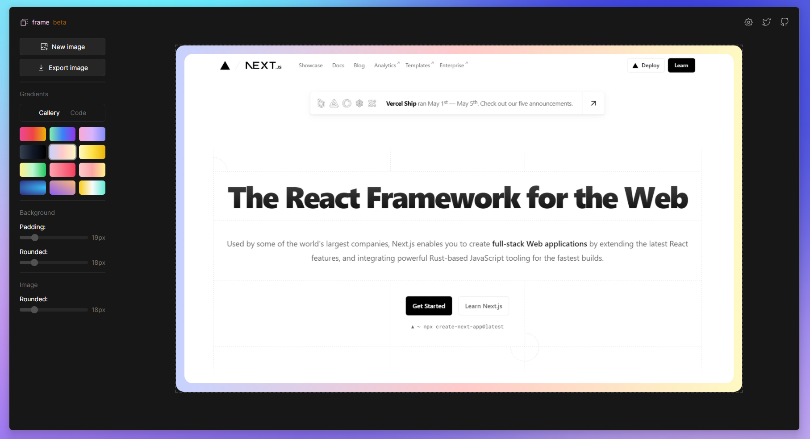

<div align="center">

<a href="https://myframe.vercel.app" target="_blank">

</a>

</p>

<div align="center">
    <a href="https://myframe.vercel.app/" target="_blank">
        Create (🚧)
    </a>
    <span>&nbsp;●&nbsp;</span>
    <a href="#-getting-started">
        Getting Started
    </a>
    <span>&nbsp;●&nbsp;</span>
    <a href="#%EF%B8%8F-stack">
        Stack
    </a>
    <span>&nbsp;●&nbsp;</span>
    <a href="#-license">
        License
    </a>
</div>

</p>


[](https://nodejs.org/about/releases)

</div>

## ⚙️ Stack

This is a [Next.js](https://nextjs.org/) project bootstrapped with [`create-next-app`](https://github.com/vercel/next.js/tree/canary/packages/create-next-app):

- [**Next.js 13 /app directory** + **Typescript**](https://nextjs.org/) - The React Framework for the Web.
- [**Tailwind CSS** + **Tailwind-Merge** + **clsx**](https://tailwindcss.com/) - A utility-first CSS framework for rapid UI development.
- [**Class Variance Authority** + **Radix-UI** primitives & **shadcn/ui** components](https://ui.shadcn.com/) - Beautifully designed components that you can copy and paste into your apps.
- [**Iconoir** icons](https://iconoir.com/) - An open-source library with 1300+ unique SVG icons, designed on a 24x24 pixels grid.
- [**Sonner**](https://sonner.emilkowal.ski/) - An opinionated toast component for React.
- [**react-dropzone**](https://react-dropzone.js.org/) - Simple React hook to create a HTML5-compliant drag'n'drop zone for files.
- [**react-resizable**](https://github.com/react-grid-layout/react-resizable) - A simple React component that is resizable with a handle.
- [**react-hotkeys-hook**](https://github.com/JohannesKlauss/react-hotkeys-hook) - React hook for using keyboard shortcuts in components.
- [**html2canvas**](https://html2canvas.hertzen.com/) - Screenshots with JavaScript.
- [**Zustand**](https://zustand-demo.pmnd.rs/) - A small, fast and scalable bearbones state-management solution using simplified flux principles.

## 🤔 Known issues/roadmap

- [x] Export images - fix white background.
- [x] Create modal to display user preferences.
- [x] Resolve image resizing.
- [ ] Improve responsive.
- [x] Allow downloading in more file types.
- [x] Upgrade to Next.js 13 /app directory.

## 🚀 Getting Started

**Recommended extensions for VSCode:**

- [Tailwind CSS IntelliSense](https://marketplace.visualstudio.com/items?itemName=bradlc.vscode-tailwindcss).
- [Prettier - Code formatter](https://marketplace.visualstudio.com/items?itemName=esbenp.prettier-vscode).
- [ESLint](https://marketplace.visualstudio.com/items?itemName=dbaeumer.vscode-eslint).

1. Clone or [fork](https://github.com/pheralb/frame/fork) the repository:

```bash
git@github.com:pheralb/frame.git
```

2. Install dependencies:

```bash
npm install
# or
yarn install
# or
pnpm install
# or
ultra install
```

3. Run the development server:

```bash
npm run dev
# or
yarn dev
# or
pnpm dev
# or
ultra dev
```

Open [http://localhost:3000](http://localhost:3000) with your browser to see the result 🚀.

## ☁️ Deploy

- [https://myframe.vercel.app/](https://myframe.vercel.app/).

## 📄 License

- [MIT License](https://github.com/pheralb/frame/blob/main/LICENSE).
